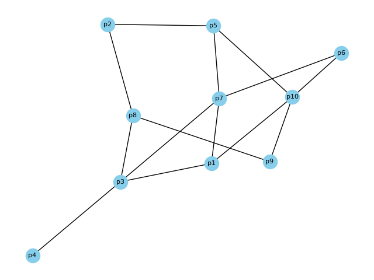

# ProteinInteractionNetwork

This repository contains the Python code for analyzing protein interaction networks.

## Project Description

This project implements a Python class called `Interaction` that models a protein interaction network. It allows you to:

* Build a network based on protein names from a file.
* Analyze network properties like average distance and small-world characteristics.
* Find the shortest path between two specific proteins.
* Visualize the network structure.
## Installation
```
python 3.12
```
### Library
The following libraries are required to run this code:
* `random`
* `networkx`
* `matplotlib.pyplot`

## Code Structure

The code is organized into a single Python file named "interaction.py". 
* The `Interaction` class defines methods for:
    * Reading protein names from a file.
    * Generating a protein interaction network with specified properties.
    * Calculating network properties like average distance and small-worldness.
    * Finding the shortest path between two proteins.
    * Visualizing the network.
* The `main` function demonstrates how to use the `Interaction` class.

## Usage

1. Clone the repository to your local machine.
2. Install the required libraries: `networkx`, `matplotlib`.
3. Run the Python script: `python interaction.py`
4. Follow the prompts to interact with the program and analyze your protein interaction network.
### Exemple of Usage 
* i chose the exeple of 14 interaction
```bash
Entrer the numbre of interaction 14
Enter the first protein : p1
Enter the second protein : p8
The distance between p1 and p8 is: 2
Average distance (R) of the network: 1.8888888888888888
Is the network a small-world network? True
Enter the node for which you wish to check the degree: p3
Degree of node p3: 4
```



## Additional Notes

* This code can be further extended to include features like:
    * Loading protein interaction data from other sources (e.g., databases).
    * Implementing different network analysis algorithms.
    * Adding functionalities for network comparison and clustering.
